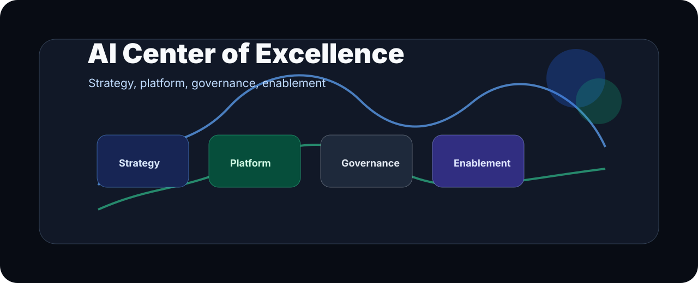

  

<h1 align="center">Awesome AI CoE</h1>

  <strong>A curated operating map for AI Centers of Excellence: agentic systems, tooling, governance, adoption, memory, evals, and enterprise rollout.</strong>

  
  
  

  <a href="#table-of-contents">Contents</a> ·
  <a href="#1-ai-coe-foundations">Foundations</a> ·
  <a href="#2-agentic-coding-tools">Agentic coding</a> ·
  <a href="#5-governance--risk">Governance</a> ·
  <a href="#9-evaluation--observability">Evals</a>

> A curated map of the best resources for building an AI Center of Excellence, focused on agentic systems, tooling, governance, and enterprise adoption.

**Audience:** Everyone researching, building, or scaling agentic AI systems.  
**Signals:** ⭐ GitHub stars · 🔗 backlinks · 📬 community submissions

---

## Operating Model

| CoE Layer | Best resources should help with |
| --- | --- |
| Strategy | Choosing high-value workflows, ownership models, and adoption paths. |
| Platform | Standardizing coding agents, MCP, memory, evals, observability, and deployment. |
| Governance | Managing risk, privacy, procurement, policy, and human review boundaries. |
| Enablement | Turning expert patterns into reusable playbooks, templates, and training loops. |

---

## Table of Contents

1. [AI CoE Foundations](#1-ai-coe-foundations)
2. [Agentic Coding Tools](#2-agentic-coding-tools)
3. [Agent Skills](#3-agent-skills)
4. [MCP Servers](#4-mcp-servers)
5. [Governance & Risk](#5-governance--risk)
6. [AGENTS.md / CLAUDE.md / Cursor Rules](#6-agentsmd--claudemd--cursor-rules)
7. [Learning & Skill Graphs](#7-learning--skill-graphs)
8. [Project Memory & Knowledge Bases](#8-project-memory--knowledge-bases)
9. [Evaluation & Observability](#9-evaluation--observability)
10. [Revenue / Growth / Demand Generation Agents](#10-revenue--growth--demand-generation-agents)
11. [Company-of-One Templates](#11-company-of-one-templates)
12. [Enterprise AI CoE References](#12-enterprise-ai-coe-references)

---

## 1. AI CoE Foundations

> Frameworks, playbooks, and reference architectures for standing up an AI Center of Excellence.

- [McKinsey — Building an AI CoE](https://www.mckinsey.com/capabilities/quantumblack/our-insights/building-an-effective-ai-center-of-excellence) — Organizational design patterns and operating models for enterprise AI.
- [MIT Sloan — AI Strategy Playbook](https://mitsloan.mit.edu/ideas-made-to-matter/artificial-intelligence) — Academic perspective on aligning AI investment with business value.
- [Google Cloud AI Adoption Framework](https://cloud.google.com/resources/ai-adoption-framework) — Maturity model covering people, process, and technology dimensions.
- [AWS AI/ML Center of Excellence Guide](https://aws.amazon.com/blogs/machine-learning/establishing-an-ai-ml-center-of-excellence/) — Practical guidance on standing up an internal CoE on AWS.
- [a16z — AI Canon](https://a16z.com/ai-canon/) — Curated reading list covering foundational AI/ML papers and concepts.
- [Anthropic — Economic Index](https://www.anthropic.com/research/anthropic-economic-index-january-2026-report) — Data on how AI is being used across occupations today.

---

## 2. Agentic Coding Tools

> IDEs, copilots, and agentic development environments that accelerate software engineering.

- [GitHub Copilot](https://github.com/features/copilot) — AI pair programmer integrated into VS Code, JetBrains, and the CLI.
- [Cursor](https://www.cursor.com/) — AI-first code editor built on VS Code; supports agent mode and codebase-wide edits.
- [Windsurf (Codeium)](https://codeium.com/windsurf) — Agentic IDE with Cascade, a collaborative AI coding flow.
- [Aider](https://github.com/paul-gauthier/aider) ⭐ — CLI tool that lets AI pair-program with you in your local Git repo.
- [Continue](https://github.com/continuedev/continue) ⭐ — Open-source autopilot for VS Code and JetBrains; bring your own LLM.
- [Devin](https://www.cognition.ai/blog/introducing-devin) — Fully autonomous software engineer agent with browser and terminal access.
- [OpenHands (OpenDevin)](https://github.com/All-Hands-AI/OpenHands) ⭐ — Open-source platform for software development agents.
- [SWE-agent](https://github.com/princeton-nlp/SWE-agent) ⭐ — Princeton research agent that resolves real GitHub issues end-to-end.

---

## 3. Agent Skills

> Libraries, patterns, and primitives for giving agents new capabilities.

- [LangChain Tools](https://python.langchain.com/docs/modules/agents/tools/) — Ecosystem of pre-built tools (search, calculator, code interpreter, etc.) for LangChain agents.
- [LlamaIndex](https://github.com/run-llama/llama_index) ⭐ — Data framework connecting LLMs to external data; includes agent tooling.
- [Composio](https://github.com/ComposioHQ/composio) ⭐ — 150+ production-ready integrations (GitHub, Jira, Slack) for AI agents.
- [Browser Use](https://github.com/browser-use/browser-use) ⭐ — Library that gives agents real browser control via Playwright.
- [Playwright MCP](https://github.com/microsoft/playwright-mcp) ⭐ — Microsoft's MCP server exposing browser automation as agent skills.
- [E2B Code Interpreter](https://github.com/e2b-dev/code-interpreter) ⭐ — Secure cloud sandbox for executing AI-generated code.
- [Toolhouse](https://toolhouse.ai/) — Universal tool layer; write tools once, use across any LLM or framework.
- [OpenAI Function Calling](https://platform.openai.com/docs/guides/function-calling) — Official guide and schemas for structured tool use in the OpenAI API.

---

## 4. MCP Servers

> Model Context Protocol servers that expose data sources and capabilities to LLM clients.

- [Model Context Protocol — Official Docs](https://modelcontextprotocol.io/) — Anthropic's open standard for connecting LLMs to external context.
- [MCP Servers (Official Registry)](https://github.com/modelcontextprotocol/servers) ⭐ — Reference implementations: filesystem, GitHub, Postgres, Slack, and more.
- [awesome-mcp-servers](https://github.com/punkpeye/awesome-mcp-servers) ⭐ — Community-maintained list of MCP servers across dozens of categories.
- [mcp.so](https://mcp.so/) — Searchable directory of community MCP servers.
- [Smithery](https://smithery.ai/) — Package registry and discovery layer for MCP servers.
- [GitHub MCP Server](https://github.com/github/github-mcp-server) ⭐ — Official GitHub MCP server exposing repos, PRs, issues, and Actions.
- [Postgres MCP Server (Archived)](https://github.com/modelcontextprotocol/servers-archived/tree/main/src/postgres) — Reference implementation (archived due to SQL injection constraints; use with read-only database connections).
- [Cloudflare MCP Server](https://github.com/cloudflare/mcp-server-cloudflare) ⭐ — Manage Cloudflare Workers, KV, R2, and D1 from an AI agent.

---

## 5. Governance & Risk

> Frameworks, standards, and tooling for responsible AI deployment.

- [NIST AI Risk Management Framework (AI RMF)](https://nvlpubs.nist.gov/nistpubs/ai/nist.ai.100-1.pdf) — US government framework for managing AI risks across the full lifecycle.
- [EU AI Act — Full Text](https://eur-lex.europa.eu/legal-content/EN/TXT/?uri=CELEX:32024R1689) — EU regulation establishing risk tiers and compliance obligations for AI systems.
- [OWASP Top 10 for LLM Applications](https://owasp.org/www-project-top-10-for-large-language-model-applications/) — Top security risks specific to LLM-powered applications.
- [Microsoft Responsible AI Principles](https://www.microsoft.com/en-us/ai/responsible-ai) — Six principles (fairness, reliability, privacy, inclusiveness, transparency, accountability) with tooling.
- [Google — Secure AI Framework (SAIF)](https://saif.google) — Security framework for AI systems covering supply chain, model, and deployment risks.
- [LLM Guard](https://github.com/protectai/llm-guard) ⭐ — Open-source toolkit for sanitizing and protecting LLM inputs/outputs.
- [Guardrails AI](https://github.com/guardrails-ai/guardrails) ⭐ — Framework for adding validation, structured output, and guardrails to LLM calls.
- [AI Fairness 360 (IBM)](https://github.com/Trusted-AI/AIF360) ⭐ — Toolkit for detecting and mitigating bias in ML datasets and models.

---

## 6. AGENTS.md / CLAUDE.md / Cursor Rules

> Conventions and templates for giving AI agents persistent, repo-level instructions.

- [AGENTS.md Spec (OpenAI)](https://platform.openai.com/docs/codex/agents-md) — OpenAI's specification for the `AGENTS.md` file used by Codex agents.
- [awesome-cursorrules](https://github.com/PatrickJS/awesome-cursorrules) ⭐ — Curated `.cursorrules` files for frameworks, languages, and project types.
- [.cursorrules Directory](https://cursor.directory/) — Community-built directory of Cursor rules searchable by stack.
- [CLAUDE.md Community Examples](https://github.com/search?q=CLAUDE.md&type=repositories) — Search GitHub for real-world `CLAUDE.md` files in open-source projects.
- [Anthropic — Model Context Protocol Memory](https://modelcontextprotocol.io/docs/concepts/resources) — Persistent resource patterns that serve a similar role to CLAUDE.md at runtime.
- [Copilot Instructions (`.github/copilot-instructions.md`)](https://docs.github.com/en/copilot/customizing-copilot/adding-custom-instructions-for-github-copilot) — GitHub Copilot's equivalent of repo-level AI instructions.

---

## 7. Learning & Skill Graphs

> Curricula, roadmaps, and structured paths for leveling up in AI and agentic systems.

- [fast.ai — Practical Deep Learning](https://course.fast.ai/) — Bottom-up, code-first deep learning course; free.
- [DeepLearning.AI Short Courses](https://www.deeplearning.ai/short-courses/) — Bite-sized courses on RAG, agents, LangChain, prompt engineering, and more.
- [Andrej Karpathy — Neural Networks: Zero to Hero](https://github.com/karpathy/nn-zero-to-hero) ⭐ — Video series building neural nets from scratch in pure Python.
- [LLM Course (mlabonne)](https://github.com/mlabonne/llm-course) ⭐ — Roadmap and notebooks covering the full LLM stack from tokens to RLHF.
- [Hugging Face NLP Course](https://huggingface.co/learn/nlp-course) — Free interactive course on Transformers, fine-tuning, and the HF ecosystem.
- [AI Engineer Roadmap](https://roadmap.sh/ai-engineer) — Visual roadmap of skills required for an AI engineer role.
- [Prompt Engineering Guide](https://github.com/dair-ai/Prompt-Engineering-Guide) ⭐ — Comprehensive guide to techniques: few-shot, chain-of-thought, RAG, and more.
- [Open Source AI Cookbook (Hugging Face)](https://huggingface.co/learn/cookbook) — Practical notebooks for building production AI applications.

---

## 8. Project Memory & Knowledge Bases

> Tools and patterns for giving AI agents persistent, searchable memory across sessions.

- [mem0](https://github.com/mem0ai/mem0) ⭐ — Memory layer for AI agents; stores user preferences and context across conversations.
- [Zep](https://github.com/getzep/zep) ⭐ — Long-term memory server for LLM apps; temporal knowledge graphs + vector search.
- [LangMem (LangChain)](https://langchain-ai.github.io/langmem/) — Memory management library in the LangChain ecosystem.
- [Cognee](https://github.com/topoteretes/cognee) ⭐ — Builds knowledge graphs from documents for accurate RAG.
- [Chroma](https://github.com/chroma-core/chroma) ⭐ — Open-source embedding database for semantic search and memory.
- [Weaviate](https://github.com/weaviate/weaviate) ⭐ — Vector database with hybrid search, multi-tenancy, and GraphQL API.
- [Qdrant](https://github.com/qdrant/qdrant) ⭐ — High-performance vector search engine with filtering and on-disk indexing.
- [LightRAG](https://github.com/HKUDS/LightRAG) ⭐ — Graph-based RAG system combining entity/relation extraction with vector retrieval.

---

## 9. Evaluation & Observability

> Frameworks and platforms for testing, tracing, and monitoring LLM-powered systems.

- [LangSmith](https://www.langchain.com/langsmith) — Tracing, evaluation, and dataset management for LangChain (and other) apps.
- [LangFuse](https://github.com/langfuse/langfuse) ⭐ — Open-source LLM observability; traces, evals, prompt management, and cost tracking.
- [Braintrust](https://www.braintrustdata.com/) — Evaluation platform with human labeling, CI evals, and playground.
- [Weave (Weights & Biases)](https://github.com/wandb/weave) ⭐ — Lightweight tracing and evaluation SDK from W&B.
- [RAGAS](https://github.com/explodinggradients/ragas) ⭐ — RAG-specific evaluation metrics: faithfulness, answer relevancy, context recall.
- [DeepEval](https://github.com/confident-ai/deepeval) ⭐ — Open-source LLM eval framework with 14+ metrics and CI integration.
- [Evals (OpenAI)](https://github.com/openai/evals) ⭐ — Framework and registry of eval tasks contributed by the community.
- [Phoenix (Arize)](https://github.com/Arize-ai/phoenix) ⭐ — Open-source AI observability tool with traces, spans, and embedding visualization.

---

## 10. Revenue / Growth / Demand Generation Agents

> Agentic workflows and tools for sales, marketing, and revenue operations.

- [Clay](https://www.clay.com/) — AI-enriched prospecting and outbound automation; pulls from 50+ data sources.
- [11x.ai](https://www.11x.ai/) — Digital workers (Alice, Jordan) for autonomous outbound sales and research.
- [Artisan](https://www.artisan.co/) — AI BDR ("Ava") that automates prospecting, personalization, and email sequences.
- [Relevance AI](https://relevanceai.com/) — No-code platform for building sales and marketing AI agents with custom tools.
- [HubSpot AI](https://www.hubspot.com/artificial-intelligence) — AI features embedded across CRM, email, content, and reporting.
- [Breeze Copilot (HubSpot)](https://www.hubspot.com/products/artificial-intelligence) — AI copilot for CRM tasks: drafting emails, summarizing deals, and generating content.
- [n8n](https://github.com/n8n-io/n8n) ⭐ — Open-source workflow automation with 400+ integrations; self-hostable.
- [Zapier AI Actions](https://actions.zapier.com/) — Expose any Zapier action as a callable tool for GPT or custom agents.

---

## 11. Company-of-One Templates

> Starter kits, templates, and stacks for solo founders and small teams running AI-augmented operations.

- [Makerpad](https://www.makerpad.co/) — No-code tutorials and templates for automating business workflows.
- [Notion AI Second Brain Template](https://www.notion.so/templates/category/ai) — AI-powered knowledge management templates for solo operators.
- [Liam Jeans — One-Person Business Stack](https://twitter.com/liamjeans_) — Curated thread on tools for running a business with AI assistance.
- [Supabase + Vercel AI SDK Starter](https://github.com/vercel/ai-chatbot) ⭐ — Full-stack AI chatbot template with auth, database, and streaming.
- [LangGraph Agent Templates](https://github.com/langchain-ai/langgraph/tree/main/examples) ⭐ — Production-ready agent patterns: ReAct, plan-and-execute, multi-agent.
- [CrewAI](https://github.com/crewAIInc/crewAI) ⭐ — Framework for orchestrating role-playing, autonomous AI agent crews.
- [AutoGPT](https://github.com/Significant-Gravitas/AutoGPT) ⭐ — Foundational autonomous agent project; modular architecture for building agents.
- [Agency Swarm](https://github.com/VRSEN/agency-swarm) ⭐ — Framework for creating reliable, customizable AI agencies using OpenAI Assistants.

---

## 12. Enterprise AI CoE References

> Case studies, organizational playbooks, and benchmarks from large-scale AI deployments.

- [BCG — AI at Scale](https://www.bcg.com/capabilities/artificial-intelligence/ai-at-scale) — How leading enterprises are moving AI from pilots to production at scale.
- [Gartner — AI CoE Maturity Model](https://www.gartner.com/en/information-technology/insights/artificial-intelligence) — Maturity assessment and roadmap for enterprise AI capability building.
- [ai-coe](https://github.com/frankxai/ai-coe) — FrankX Enterprise AI Center of Excellence hub: reference models, standards, evaluation suites, and training frameworks.
- [ai-capability-registry](https://github.com/frankxai/ai-capability-registry) — Central catalog for prompt templates, agent capability cards, and evaluation metrics.
- [ai-architect-academy](https://github.com/frankxai/ai-architect-academy) — Training blueprints, lesson plans, and practical workshops for enterprise AI architects.
- [Deloitte — State of AI in the Enterprise](https://www2.deloitte.com/us/en/insights/focus/cognitive-technologies/state-of-ai-and-intelligent-automation-in-business-survey.html) — Annual survey of AI adoption, ROI, and organizational challenges.
- [Microsoft AI Transformation Playbook](https://adoption.microsoft.com/en-us/ai/) — Step-by-step guide for enabling Microsoft 365 Copilot across an enterprise.
- [Salesforce AI Enterprise Playbook](https://www.salesforce.com/artificial-intelligence/) — Resources for deploying Einstein AI across sales, service, and marketing.
- [Stanford HAI — AI Index Report](https://aiindex.stanford.edu/report/) — Annual benchmark of global AI research, adoption, and policy trends.
- [McKinsey Global Institute — The Economic Potential of Generative AI](https://www.mckinsey.com/capabilities/mckinsey-digital/our-insights/the-economic-potential-of-generative-ai-the-next-productivity-frontier) — $2.6–4.4T annual impact analysis across use cases and industries.
- [IBM Institute for Business Value — CEO Guide to Generative AI](https://www.ibm.com/thought-leadership/institute-business-value/en-us/c-suite-study/ceo/generative-ai) — Executive-level framework for embedding generative AI into business strategy.

---

## Contributing

Submissions welcome! Open an issue or PR with:
- A link to the resource
- The target section
- A one-line description

Please ensure resources are publicly accessible and actively maintained.

---

## License

To the extent possible under law, the contributors have waived all copyright and related or neighboring rights to this work.
