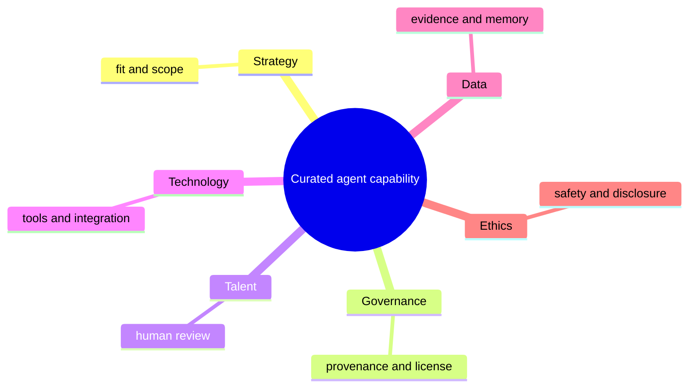

# Awesome AI Center of Excellence

  

> Web-first resources for accountable AI CoE practice: standards, evaluation, skills, orchestration, and operating guardrails.

This is an independent, **web-first** catalog. It remains useful if every FrankX link is removed: third-party primary sources lead, while companion lists appear only at the end.

## Start here

Assign clear owners for policy, data, architecture, procurement, and releases. Pilot separately from production and measure evidence—not demos.

<!-- earned-skill-index:2026-08-30 -->

## Earned agent skills (start here)

Operators get leverage from **about 5–7 named workflows**, not bulk dumps. Hub: [https://github.com/frankxai/awesome-hermes-agent-skills](https://github.com/frankxai/awesome-hermes-agent-skills) · [earned index](https://github.com/frankxai/awesome-hermes-agent-skills/blob/main/docs/EARNED-SKILLS.md) · [safety gate](https://github.com/frankxai/awesome-hermes-agent-skills/blob/main/docs/QUALITY-AND-SAFETY.md).

**AI CoE operating skills**

| Pack | Job |
| --- | --- |
| [obra/superpowers](https://github.com/obra/superpowers) | SDLC methodology (TDD, review, debug) |
| [garrytan/gstack](https://github.com/garrytan/gstack) | Product / design / QA operating system |
| [anthropics/skills](https://github.com/anthropics/skills) | Official vendor examples |
| [NVIDIA/SkillSpector](https://github.com/NVIDIA/SkillSpector) | Skill supply-chain scan |
| [github/awesome-copilot](https://github.com/github/awesome-copilot) | Copilot agents/instructions |

Scan with [NVIDIA SkillSpector](https://github.com/NVIDIA/SkillSpector) before a live profile. Do not install unsigned ZIP/S3 skill blobs or OpenClaw mass dumps.

## Peer directories and standards

[microsoft/skills](https://github.com/microsoft/skills) · [agentskills/agentskills](https://github.com/agentskills/agentskills)

## Curated catalog

| Project | Pulse snapshot | Why it is here |
| --- | --- | --- |
| [Agent Skills](https://github.com/agentskills/agentskills) | Apache-2.0 · 23,762★ | Portable capability standard. |
| [Microsoft skills](https://github.com/microsoft/skills) | MIT · 2,853★ | Skills, MCP, custom agents, AGENTS.md. |
| [Agentic Awesome Skills](https://github.com/sickn33/agentic-awesome-skills) | MIT · 44,310★ | Large peer catalog; curate before install. |
| [AutoGen](https://github.com/microsoft/autogen) | CC-BY-4.0 · 60,169★ | Agentic AI framework. |
| [LangGraph](https://github.com/langchain-ai/langgraph) | MIT · 38,702★ | Resilient stateful agents. |
| [gstack](https://github.com/garrytan/gstack) | MIT · 125,927★ | Product/design/engineering QA workflows. |
| [OpenAI Agents SDK](https://github.com/openai/openai-agents-python) | MIT · 28,345★ | Small explicit multi-agent primitives. |
| [SkillOpt](https://github.com/microsoft/SkillOpt) | MIT · 15,636★ | Validation-gated skill optimization; isolate pilots and retain human evaluation. |
| [SkillSpector](https://github.com/NVIDIA/SkillSpector) | Apache-2.0 · 14,227★ | Pre-install skill scanning for supply-chain and prompt-injection signals; advisory, not a sandbox. |

Editorial curation lens (optional)

```mermaid
mindmap
  root((Curated agent capability))
    Strategy
      fit and scope
    Governance
      provenance and license
    Talent
      human review
    Technology
      tools and integration
    Data
      evidence and memory
    Ethics
      safety and disclosure
```

This lens is editorial, not an endorsement or a claim that a project satisfies every pillar.

## Explore the Full FrankX Awesome Ecosystem (optional)

Companion catalogs are optional; the third-party projects above are this list's primary value.

- [awesome-hermes-agents](https://github.com/frankxai/awesome-hermes-agents) · [awesome-manifestation-skills](https://github.com/frankxai/awesome-manifestation-skills) · [awesome-ai-coe](https://github.com/frankxai/awesome-ai-coe)
- [awesome-agentic-income](https://github.com/frankxai/awesome-agentic-income) · [awesome-investor-agent-skills](https://github.com/frankxai/awesome-investor-agent-skills) · [awesome-design-agent-skills](https://github.com/frankxai/awesome-design-agent-skills) · [awesome-agent-operating-systems](https://github.com/frankxai/awesome-agent-operating-systems)
- [awesome-music-agent-skills](https://github.com/frankxai/awesome-music-agent-skills) · [awesome-hermes-agent-skills](https://github.com/frankxai/awesome-hermes-agent-skills) · [awesome-gamification-agent-skills](https://github.com/frankxai/awesome-gamification-agent-skills) · [awesome-wealth-agent-skills](https://github.com/frankxai/awesome-wealth-agent-skills)
- [awesome-mind-agent-skills](https://github.com/frankxai/awesome-mind-agent-skills) · [awesome-cosmos-ai-agents](https://github.com/frankxai/awesome-cosmos-ai-agents) · [awesome-automation-agent-skills](https://github.com/frankxai/awesome-automation-agent-skills) · [awesome-payment-agent-skills](https://github.com/frankxai/awesome-payment-agent-skills) · [awesome-motion-design-agent-skills](https://github.com/frankxai/awesome-motion-design-agent-skills)

## Contribution standard

Open a PR with a primary URL, one-sentence distinct value, current maintenance evidence, license posture, and relevant safety/deployment caveat. Do not submit affiliate links, private workflow exports, unverified claims, or a product pitch in place of a useful third-party resource.

## Research method

This monthly pulse queried selected GitHub repository metadata on **2026-08-05** for identity, approximate stars, archived state, activity, and license posture. Earlier rows retain their prior dated snapshots where they were not re-fetched. `NOASSERTION` means GitHub did not return a standard SPDX identifier; review the repository license before adoption. Counts are dated discovery signals, not rankings. Nothing here is financial, legal, medical, or safety advice.

## License

[CC0 1.0](LICENSE) — dedicated to the public domain.

Maintained as independent, web-first curation by FrankX. Last research pulse: **2026-08-05**.

<!-- STARLIGHT:OPERATING:BEGIN v2 sha=9f8fecc91edc source=794db1e51a55a128816f7aa266eb0ac1dbd452c3 -->

## Agent operating guidance

Repository agents use the shared Starlight operating contract in `AGENTS.md` alongside local instructions.
The contract asks agents to establish a useful outcome, select relevant skills, complete authorized work,
verify current sources, refine the actual artifact, and report evidence and remaining gates.
It covers human agency, privacy, rights, resource stewardship and bounded proactivity.
Repository identity, brand, canon, build commands and release gates remain local.

[Pinned contract](https://github.com/frankxai/Starlight-Intelligence-System/blob/794db1e51a55a128816f7aa266eb0ac1dbd452c3/docs/architecture/agents-md/band-a.md)
· [Projection and verification](https://github.com/frankxai/Starlight-Intelligence-System/blob/794db1e51a55a128816f7aa266eb0ac1dbd452c3/docs/architecture/AGENTS-MD-CONTRACT.md)

These files supply operating guidance. They do not activate an agent, grant tool permissions,
schedule recurring work, certify compliance or prove a live capability.

<!-- STARLIGHT:OPERATING:END -->
